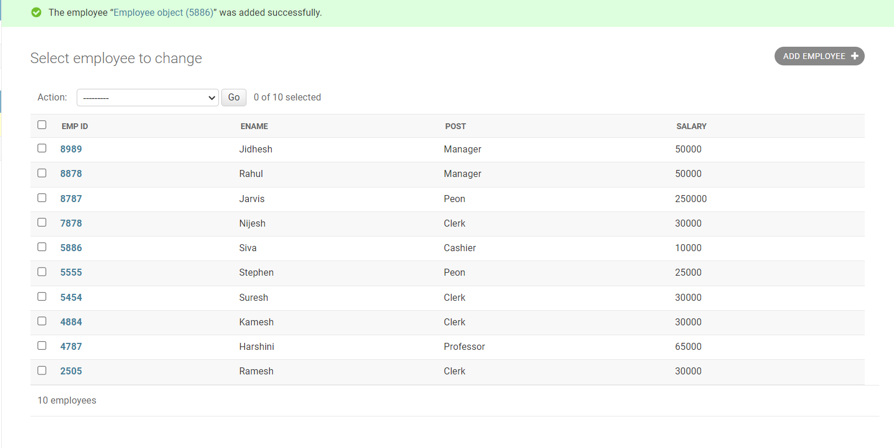

# Django ORM Web Application

## AIM
To develop a Django application to store and retrieve data from a database using Object Relational Mapping(ORM).

## Entity Relationship Diagram

Include your ER diagram here

## DESIGN STEPS

### STEP 1:
Make new folder and fork the repository to it.

### STEP 2:
Now using cd command navigate to django-orm-app

### STEP 3:
now navigate to dataproject folder

### STEP 4:
Now create a app called myapp

### STEP 5:
Now apply all migrations

### STEP 6:
Now write the necessary code for models.py and admin.py

### STEP 7:
Now create a superuser with user name as admin and mail id as admin@example.com and a passsword.

### STEP 8:
Now run the server and navigate to admin page

### STEP 9:
Now create 10 employees


## PROGRAM

### Models.py code:
```
from django.contrib import admin


# Create your models here.
class Student (models.Model):
    referencenumber=models.CharField(max_length=20,help_text="reference number")
    name=models.CharField(max_length=100)
    age=models.IntegerField()
    email=models.EmailField()


class StudentAdmin(admin.ModelAdmin):
    list_display=('referencenumber','name','age','email')


class Employee (models.Model):
   emp_id=models.CharField(primary_key=True,max_length=4,help_text='Employee ID')
   ename=models.CharField(max_length=50)
   post=models.CharField(max_length=20)
   salary=models.IntegerField()
   


class EmployeeAdmin(admin.ModelAdmin):
    list_display=('emp_id','ename','post','salary')```

Write the following code in admin.py

```from django.contrib import admin
from .models import Student,StudentAdmin,Employee,EmployeeAdmin


# Register your models here.
admin.site.register(Student,StudentAdmin)
admin.site.register(Employee,EmployeeAdmin)
```

### Admin.py code:
```
from django.contrib import admin
from .models import Student,StudentAdmin,Employee,EmployeeAdmin


# Register your models here.
admin.site.register(Student,StudentAdmin)
admin.site.register(Employee,EmployeeAdmin)

```

## OUTPUT




## RESULT
